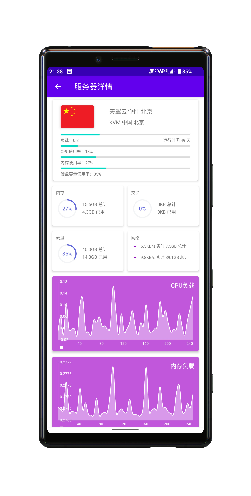

# Utopia Server Status

 

 

这是一个[ServerStatus-Hotaru](https://github.com/cokemine/ServerStatus-Hotaru)的安卓客户端

请在[GitHub Release](https://github.com/UtopiaXC/Utopia-Server-Status/releases) 或 [GitLab Release](https://git.utopiaxc.cn/UtopiaXC/utopia-server-status/-/releases) 下载

| 主页                             | 服务器列表                         |
| -------------------------------- | ---------------------------------- |
|  |  |

| 服务器                             | 设置                               |
| -------------------------------- | ---------------------------------- |
|  |  |

| 关于                             | 欢迎                               |
| -------------------------------- | ---------------------------------- |
|  |  |
